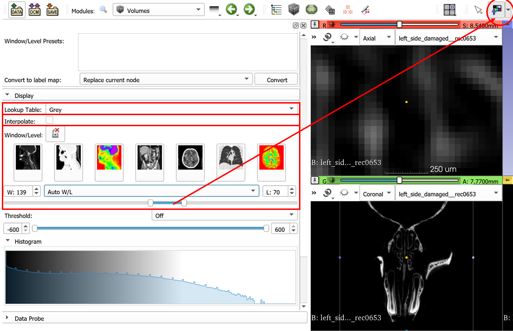

## Crop Volume and Volumes Module

We will review three Slicer modules that you will use frequently in this course:

1. `SampleData`: lets you download sample dataset bundled with Slicer. Extensions, such as SlicerMorph, can add their own sample datasets, in addition to the  sample datasets that is provided by Slicer. 
2. `Volumes`: which lets user view important information such as image spacing, orientation, data type etc about loaded 3D volume(s)
3. `CropVolume`: which lets user downsample, supersample or crop an existing volume with or without interpolation.

### Sample Data
1. Go to File->Download Sample Data and review the shown datasets. First 15 datasets are bundled with Slicer and second part is available only after you install the SlicerMorph extension. 

2. Scroll down to SlicerMorph section, and click **sample_Skyscan_mCT_reconstruction.zip**. For the 1st time you use it, this file will be downloaded from internet to the Slicer's **Cache** folder. (If you don't know where that is, you can check it by going to Edit->Application Settings->Cache). Note that this is the same dataset we used in the `ImageStacks` tutorial. 

3. Unzip the contents of the archive to a convenient location. 

### Volumes

1. Follow the instructions from the `ImageStacks` tutorial to import the sample data from previous step. 

2. Go to `Volumes` module and review the **Volume Information** section to see where volume dimensions, image spacing and data type are reported (along with image geometry ).

3. Next, go down to the **Display** section. This is where the lookup table (LUT) for volumes can be set. Greyscale is the default LUT for scalar volumes, but you can manually change this to more exotic LUTs. Contrasting LUTs such as  **Green** or  **Red** can be useful when you want to superimpose two volumes (e.g., a contrast-enhanced scan for soft-tissue, and a normal CT) and visualize the results.

4. Window/Level slider lets you adjust the contrast of the image. This does not impact the voxel values, simply changes the contrast. You can also use the topbar icon to adjust the W/L. Expand the dropdown for W/L related functionality (e.g., choose a specific region for better contrast)

5. Review the **Interpolation** option and note that voxel boundaries are blurred when interpolation is enabled, which is the default setting in Slicer. While this results in smoother looking images in slice views, you may want to disable the interpolation during manual segmentations, particularly if you need to follow voxel boundaries for your task. **Note:** Interpolation option has no effect on the 3D rendering of the volume, it only impacts the slice views.

**IMPORTANT** If you have more than one volume loaded into your scene, the info given for the "Active Volume" may not be the volume have been looking at in slice views. Get into the habit of setting the slice view visibility of any volume by using the little eye icon in `Data` module. 

### Crop Volume
Regardless of whether you are only interested in a small subset of your volume, in Slicer the entire volume (and volumes if you are working with more than one dataset in the same scene) is kept in the memory (RAM). During segmentation, memory consumption may increase 10X (e.g. if you have 1GB dataset, at times you may need 10GB of available RAM). You can greatly reduce your memory footprint during segmentation, by creating a new volume that only contains the subset. Alternatively, if you have to work with the full extend of the data, but encounter memory issue during subsequent operations, you may want to downsample your volume.  `CropVolume` is the easiest way of achieving downsampling (or alternatively supersampling) your volumes. 

<<<<<<< HEAD
1. Continuing from the previous step, go to `CropVolume` and enter the settings shown below. If the ROI creates is too small, hit the **Fit ROI to Volume** button and hit Apply. Then choose to create a new volume that will contain the output of the operation. In my case I called it **left_side_damaged_reduced**, which will be reduced by 50% in each axis. Accordingly, the image spacing will doubled. Compare the reported input and output volume dimensions and spacing. This operation will result in 8 folds reduction in the data volume, at the expense of image detail.

2. Now, repeat the procedure one more time, but this time set the limits of the ROI by modifying the small circular handles in slice views. I set my ROI to contain only the nasal region. Choose to create a new output volume (mine was called **Nasal_septum_and_turbinates**), and disable the interpolation. We do not need to interpolate the voxel intensity values, because we simply removing the data outside of our ROI and not doing anything else to the rest. Compare the resultant image dimensions and spacing of input and output volumes. Hit Apply. This procedure also reduces the data volume approximately 10 folds, but there is no reduction in the image quality. 
=======
1. Continuing from the previous step, go to `CropVolume` and enter the settings shown below. If the ROI creates is too small, hit the **Fit ROI to Volume** button and hit Apply. This will create a new volume in your scene called **left_side_damaged_reduced** which will be reduced by 50% in each axis. Accordingly, the image spacing will doubled. Compare the reported input and output volume dimensions and spacing. This operation will result in 8 folds reduction in the data volume, at the expense of image detail.

2. Now, repeat the procedure one more time, but this time set the limits of the ROI by modifying the small circular handles in slice views. I set my ROI to contain only the nasal region. Choose to create a new output volume (mine was called **Nasal_septum_and_turbinates**), and disable the interpolation. We do not need to interpolate the voxel intensity values, because we simply removing the data outside of our ROI and not doing anything else to the rest. Compare the resultant image dimensions and spacing of input and output volumes. Hit Apply.
>>>>>>> 45c04731f0bd727beaf08a7a1e3ce6c16f5ad097

### IMPORTANT TECHNICAL NOTES

**Anisotropic data** If you are working with anisotropic voxels (i.e., different image spacing along different axes), you may want to enable **isotropic** option so that the resultant volume has isotropic spacing. Isotropic voxel alleviates some of the issues you may encounter with `Segment Editor` with anisotropic datasets. Images produced by medical CT scanners tend to have anisotropic spacing (usually Z axis is of lower resolution than X and Y) 

<<<<<<< HEAD
**Best practice for downsampling** Which one should you prefer to downsample your large dataset? Downsample during the import using the `ImageStacks`, or downsample with `CropVolume`? The answer depends on your dataset and the available memory on your computer. Short answer is use `CropVolume`, if you can import the full resolution dataset into Slicer with `ImageStack`. That's becaue all the image operations within Slicer is done using 3D information. So when a volume is reduced by 2, averaging happens in 3D space. This is in contrast to other programs like ImageJ/FIJI, as well as our downsample option of our `ImageStacks` tool, which will average a slice in 2D space and then skip the next. It is far more quick (and low memory footprint) to do it in 2D. While the difference tends to be small, our suggestion is if you have enough memory use `CropVolume` to downsample, which will give you a more accurate representation. Plus, you will have the full-resolution dataset, when/if you need to go back to.   
=======
**Best practice for downsampling** Which one should you prefer to downsample your large dataset? Downsample during the import using the `ImageStacks`, or downsample with `CropVolume`? The answer depends on your dataset and the available memory on your computer. Short answer is use `CropVolume`, if you can import the full resolution dataset into Slicer with `ImageStack`. That's becaue all the image operations within Slicer is done using 3D information. So when a volume is reduced by 2, averaging happens in 3D space. This is in contrast to other programs like ImageJ/FIJI, as well as our downsample option of our `ImageStacks` tool, which will average a slice in 2D space, and then skip the next. It is far more quick with low memory footprint memory to do it in 2D. While the difference tends to be small, our suggestion is if you have enough memory use `CropVolume` to downsample, which will give you a more accurate representation. Plus, you will have the full-resolution dataset, when you want to go back to.   
>>>>>>> 45c04731f0bd727beaf08a7a1e3ce6c16f5ad097
