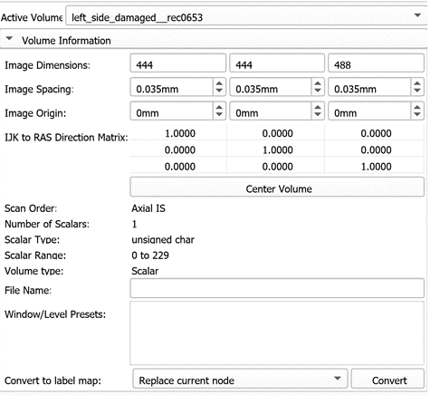
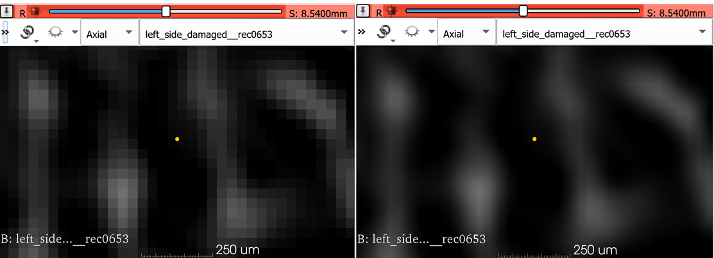

## Crop Volume and Volumes Module

We will review three Slicer modules that you will use frequently in this course:

1. `SampleData`: lets you download sample dataset bundled with Slicer. Extensions, such as SlicerMorph, can add their own sample datasets, in addition to the  sample datasets that is provided by Slicer. 
2. `Volumes`: which lets user view important information such as image spacing, orientation, data type etc about loaded 3D volume(s)
3. `CropVolume`: which lets user downsample, supersample or crop an existing volume with or without interpolation.

### Sample Data
1. Go to File->Download Sample Data and review the shown datasets. First 15 datasets are bundled with Slicer and second part is available only after you install the SlicerMorph extension. 

2. Scroll down to SlicerMorph section, and click **sample_Skyscan_mCT_reconstruction.zip**. For the 1st time you use it, this file will be downloaded from internet to the Slicer's **Cache** folder. (If you don't know where that is, you can check it by going to Edit->Application Settings->Cache). Note that this is the same dataset we used in the `ImageStacks` tutorial. 

3. Unzip the contents of the archive to a convenient location. 

### Volumes

1. Follow the instructions from the `ImageStacks` tutorial to import the sample data from previous step. 

2. Go to `Volumes` module and review the **Volume Information** section to see where volume dimensions, image spacing and data type are reported (along with image geometry ).

3. Next, go down to the **Display** section. This is where the lookup table (LUT) for volumes can be set. Greyscale is the default LUT for scalar volumes, but you can manually change this to more exotic LUTs. Contrasting LUTs such as  **Green** or  **Red** can be useful when you want to superimpose two volumes (e.g., a contrast-enhanced scan for soft-tissue, and a normal CT) and visualize the results.

4. Window/Level slider lets you adjust the contrast of the image. This does not impact the voxel values, simply changes the contrast. You can also use the topbar icon to adjust the W/L. Expand the dropdown for W/L related functionality (e.g., choose a specific region for better contrast)

5. Review the **Interpolation** option and note that voxel boundaries are blurred when interpolation is enabled, which is the default setting in Slicer. While this results in smoother looking images in slice views, you may want to disable the interpolation during manual segmentations, particularly if you need to follow voxel boundaries for your task. **Note:** Interpolation option has no effect on the 3D rendering of the volume, it only impacts the slice views.

**IMPORTANT** If you have more than one volume loaded into your scene, the info given for the "Active Volume" may not be the volume have been looking at in slice views. Get into the habit of setting the slice view visibility of any volume by using the little eye icon in `Data` module. 

### Crop Volume

