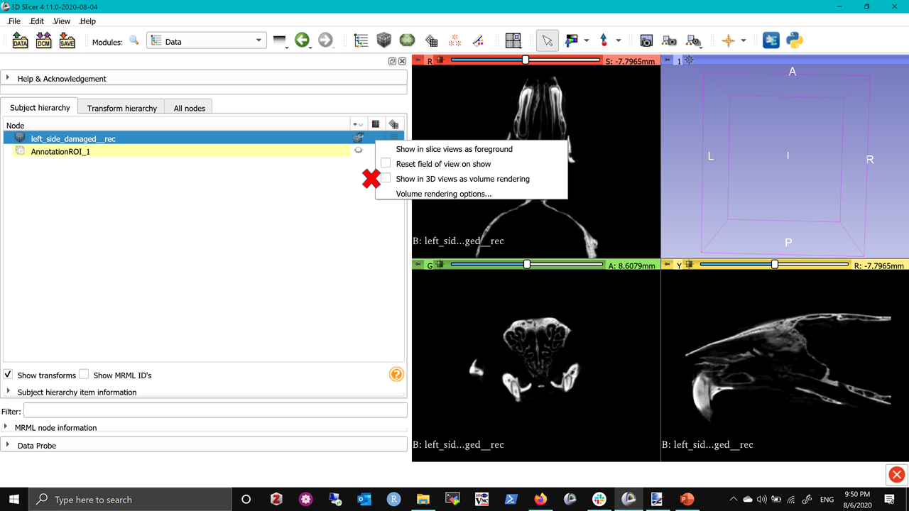
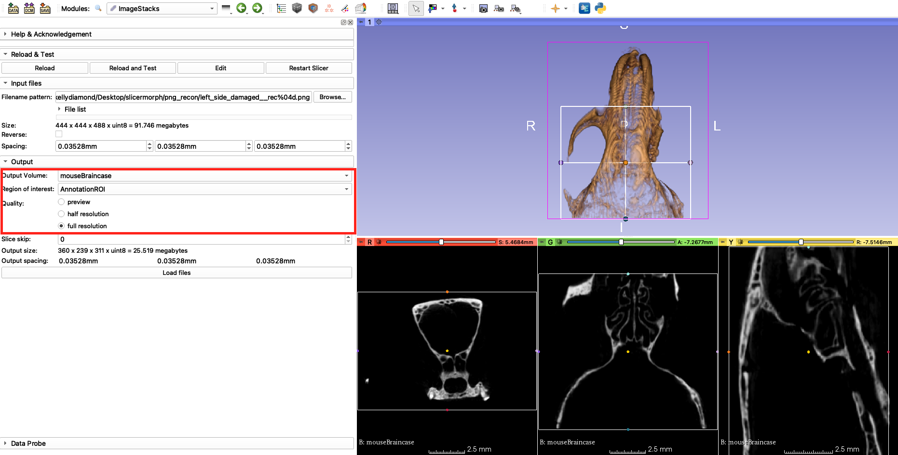
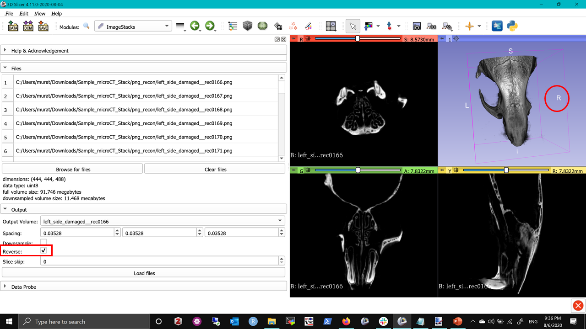
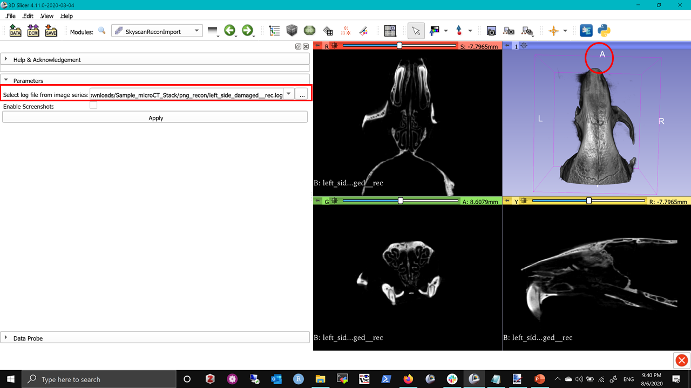

## ImageStacks
This is a SlicerMorph specific utility to import non-DICOM image sequences (TIF/PNG/JPG/BMP) into 3D Slicer. It provides additional features such as only loading a subset of the data, downsampling (by factor of 2), skipping slice(s) along the Z plane, and reverse the stack order. You can also specify the voxel spacing for your dataset at the import time. `ImageStacks` always produces a ScalarVolume (single channel), so that volumes can be immediately visualized or can be processed with `Segment Editor`.

To use the `ImageStacks` module in SlicerMorph, first go to the `Sample Data` module and download the *Bruker/Skyscan mCT Recon Sample* data OR you can download teh same file here: <a href="https://app.box.com/s/zvs162oja7tzszesmygnqs15t631y15m/file/701646040827" target="_blank"> Sample_microCT_stack.zip</A>, and unzip to a location. 

Then find the `ImageStacks` under SlicerMorph menu folder and:

1. Click the **Browse...** button and select a *PNG* file in the folder you just unzipped.

2. Image spacing in this dataset is provided in the accompanying left_side_damaged__rec.log file as 35.28 micron. Enter this value in millimeters as 0.03528 for all three axes
3. You leave the **Output Volume** blank, which will use the filename prefix. Or you can choose to create a new volume name. 
4. To preview a low resolution version of your file make sure the **preview** quality option is slected and click **Load Files** and see that all three slices viewers contain a low resolution version of our data.
5. To visualize what the specimen looks like, go to `Data` module and right-click just to the right of the eye button and then choose 'Show 3D views as Volume Rendering'. (Note: We will cover `Volume Rendering` module in great detail tomorrow. For the time being, this is all you need). You may need to center your volume using the crosshairs button or zoom in in order to see the 3D volume in the window. 

6. If everything looks good and you want to visualize the full resolution version of your entire file you can go back to the `ImageStacks` module, change the quality from **preview** to **full resolution**
7. Let's say you have a large file and you only want to visualize a portion of the total scanned volume at full resolution, such as only segmenting the braincase of the mouse. Before loading in the full resolution volume, we can do that useing a region of interest on the preview resolution image. First in the `Data` module click the eye ball button to view the **AnnotationROI** and use the collored circles so that the ROI includes only the mouse braincase. Now go to the `ImageStacks` modlue and select the **AnnotationROI** for the Region of interest and create a new output volume (I've named mine mouseBraincase), change the Quality to **full resolution** and click **Load Files**

Notice that the slice views show only the volume in the region of interest and are now full resolution. 

### What if my image is flipped (right and left sides of the specimens are mirrored) 

This is a standard problem of using image stacks to convey geometric information. There is no convention of what the **top** of the stack versus **bottom** of the stack is. It is all relative and depends on the scanner vendors' convention. To mitigate this issue, `ImageStacks` offers a **Reverse** option, which basically flips the stack 180 degrees and corrects this mirroring.

This is a common problem across 3D visualization programs, when image sequences are used to present 3D data. Because of this, it is very important to have independent confirmation of correct import procedure. Look for asymmetrical structures on your specimen and confirm that they appear on the correct side in the 3D rendering. After a successful import (correct specimen size, orientation) you should immediately save your data in a proper 3D volume format that will retain this information (which will be our next topic). 

### Further exploration

1. Use the other options of the `ImageStacks` and see how you can subset your data (hint, just choose a portion of the sequence, not all files), downsample and skip slices. 
2. Try using the `ImageStacks` tool to import any data you have of reconstructed files 

## SkyscanReconImport
Note that while **reverse** corrected the mirroring issue, specimen is not correctly oriented in anatomical space (e.g., Inferior is marked as the front of the specimen). Again this goes back to the issue of microCT scanners not having coordinate convention. With a trial and error you can find the right transformation necessary to put the specimen into the correct space for your particular scanner. We have calculated that for our Bruker/Skyscan microCT and provide another module called `SkyScanReconImport` for the Skyscan users. 

To use this tool, find the `SkyScanReconImport` and simply point out the file browser to the scanner log (**left_side_damaged__rec.log**) provided in the folder. Module will read the correct image spacing, filename prefix provided in the log and automatically populate these fields, so no additional user intervention is required. 

When you enable the Volume Rendering as described above, you see that the anatomical orientation labels correctly line up with the specimen. 

**NOTE** For this transformation to hold, the specimen should be oriented in the scanner bed such that the anterior of the specimen should be closest to the scanner, and operator should be looking down to the dorsal (top) surface (see the specimen picture above). We only tested this with Bruker 1076. So if you are Bruker users, we appreciate if you can provide further feedback about whether this tools works for you. 

### What about getting data from other scanners' proprietory formats?

In addition to as image stacks, different microCT vendors output data in different formats (e.g., multi-frame tiff) or into their own proprietory format (e.g., Scanco). While multiframe tiff is supported, in other cases you may want to use `RawImageGuess` module, which is another extension bundled with SlicerMorph, to import foreign data. In a nutshell, `RawImageGuess` allows you to guess key image information such as image dimensions, data type, header size in a convenient and interactive way. [This video shows it in action](https://www.youtube.com/watch?time_continue=3&v=ajpOQEAyWkA&feature=emb_logo).

Knowing the correct values for image dimensions and data type will greatly expedite the guessing procedure. See this blog for [an alternative approach to importing data from Scanco by using information from their log files](https://blogs.uw.edu/maga/2018/09/importing-microct-data-from-scanco-into-slicer/), which predates the RawImageGuess module. You can just take these values and directly enter into the `RawImageGuess` module and quickly import the data into Slicer.

See this link for more information about [`RawImageGuess`] extension(https://github.com/acetylsalicyl/SlicerRawImageGuess/).
