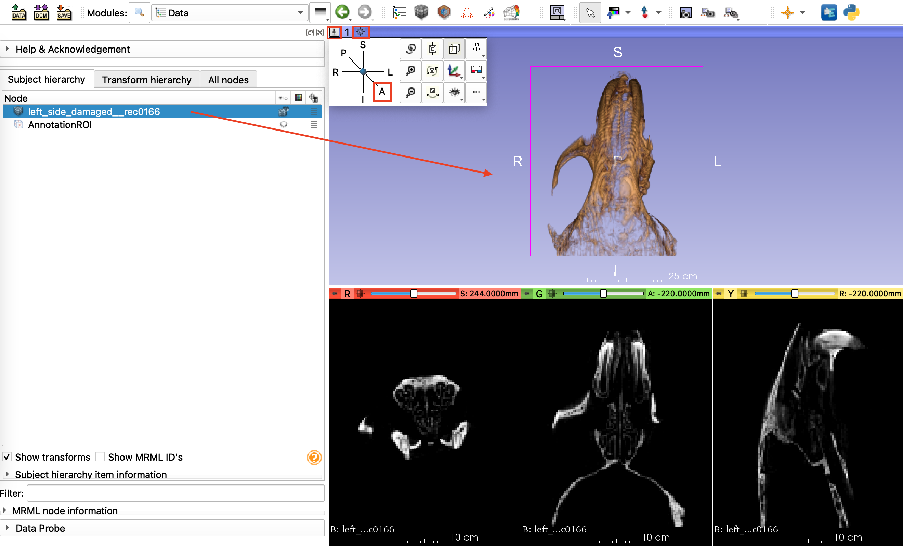
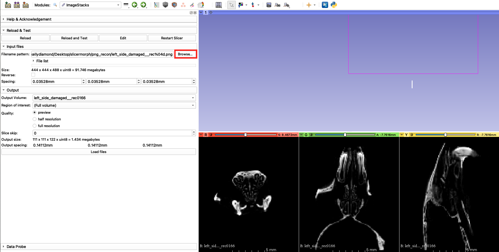

## ImageStacks
This is a SlicerMorph specific utility to import non-DICOM image sequences (TIF/PNG/JPG/BMP) into 3D Slicer. It provides additional features such as only loading a subset of the data, downsampling (by factor of 2), skipping slice(s) along the Z plane, and reverse the stack order. You can also specify the voxel spacing for your dataset at the import time. `ImageStacks` always produces a ScalarVolume (single channel), so that volumes can be immediately visualized or can be processed with `Segment Editor`.

To use the `ImageStacks`, first download <a href="https://app.box.com/s/zvs162oja7tzszesmygnqs15t631y15m/file/701646040827" target="_blank"> Sample_microCT_stack.zip</A>, and unzip to a location. 

Then find the `ImageStacks` under SlicerMorph menu folder and:

1. Click the **Browse Files** button and select all *PNG* files in the folder you just unzipped.
2. Image spacing in this dataset is provided in the accompanying left_side_damaged__rec.log file as 35.28 micron. Enter this value in millimeters as 0.03528 for all three axes
3. You leave the **Output Volume** blank, which will use the filename prefix. Or you can choose to create a new volume name. 
4. Click **Load Files** and see that all three slices viewers contain our data.
5. To visualize what the specimen looks like, go to `Data` module and right-click in the area shown in green arrow and then choose 'Show 3D views as Volume Rendering'. (Note: We will cover `Volume Rendering` module in great detail tomorrow. For the time being, this is all you need)

and see that the resultant rendering show the damage to the zygomatic arch in the **right side** of the specimen. Curiously, the specimen is named **Left side damaged**. 

Indeed you can check what the real specimen looks like by going to the link below, and confirm that it is indeed the left zygomatic arch is missing. 

<a href="https://app.box.com/s/zvs162oja7tzszesmygnqs15t631y15m/file/701653679714"> **Picture of the specimen in the sample stack** </A>

This is a standard problem of using image stacks to convey geometric information. There is no convention of what the **top** of the stack versus **bottom** of the stack is. It is all relative and depends on the scanner vendors' convention. To mitigate this issue, `ImageStacks` offers a **Reverse** option, which basically flips the stack 180 degrees and corrects this mirroring.

This is a common problem across 3D visualization programs, when image sequences are used to present 3D data. THat's why we don't like them, and would prefer to keep our data in proper 3D formats that retain critical information such as orientation of axes, image spacing and others. In fact, saving the data in NRRD format right after a successful import is what we suggest. 

## SkyscanReconImport
Note that reversing corrected the mirroring issue, specimen is not correctly oriented in anatomical space (e.g., Inferior is marked as the front of the specimen). Again this goes back to the issue of microCT scanners do not have a strict anatomical coordinate convention. With a trial and error you can find the right transformation necessary to put the specimen into the correct space. We have calculated that for our Bruker/Skyscan microCT and provide another module called `SkyScanReconImport` for the Skyscan users. 

To use this tool, find the `SkyScanReconImport` and simply point out the file browser to the scanner log (**left_side_damaged__rec.log**) provided in the folder. The module read the correct image spacing, and the filename prefix provided in the log and automatically populate these fields, so no additional user intervention is required. 

When you enable the Volume Rendering as described above, you see that the anatomical orientation labels correctly line up with the specimen. 

**NOTE** For this transformation to hold, the specimen should be oriented in the scanner bed such that the anterior of the specimen should be closest to the scanner, and operator should be looking down to the dorsal (top) surface (see the specimen picture above). We only tested this with Bruker 1076. So if you are Bruker users, we appreciate if you can provide further feedback about whether this tools works for you. 
