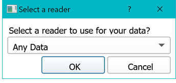
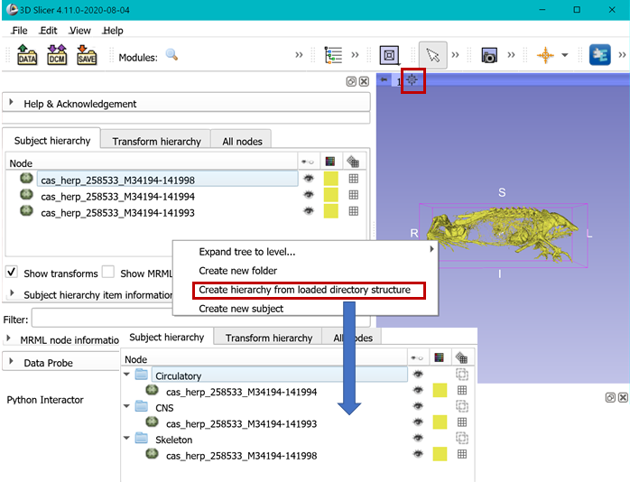
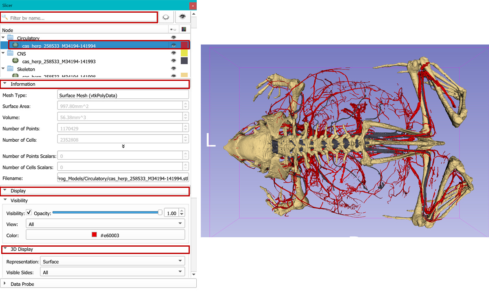

## Models Module

Slicer support STL/OBJ/PLY/VTK formats for 3D models (also called meshes). When loaded into SLicer, any model in one of these formats will be immediately visualized in 3D viewer. `Module` module provides a convenient interface:

-   to gather important information about the model such volume, area, number of vertices and polygons. (Information section)
-   to adjust Color, transparency, and visibility of model (Visibility) 
-   to adjust rendering option such as to display vertex edges, material type, shading etc (3D Display section) 
-   to display scalars (such as loading heat maps of statistical significance, or distances)

At the moment, this is the [official documentation for `Models` module](https://www.slicer.org/wiki/Documentation/Nightly/Modules/Models).  

**NOTE:** If your surface model has texture maps, it will not be loaded immediately along with the model. You can use the SlicerIGT extension (bundled with SlicerMorph) to import your texture maps (see below). 

Download the sample data called [MorphoSource-Frog-Models.zip](https://app.box.com/s/3dmwhcs579mm7ijo501c3l1uuppnypq8) and unzip to a folder on your desktop. Drag and drop the contents of this folder to Slicer. A popup window will ask what Data Reader you want to use to import them and select **Any Data**, and see that three models are now showing in your `Data` module, as well as in the 3D viewer (you may need to center the scene and zoom in).

-   Go to the `Data` module, and right-click an empty spot in the **Subject Hierarchy** view and select **Create Hierarchy from loaded directory structure** option. This will duplicate the directory structure in the disk in the `Data` module. This can be useful, if you already organized your data into some sort of hierarchical structure on your disk. 

-   Now go to `Models` module, and adjust the colors of the different models so that they are more easily distinguished in 3D view, and explore the diffent sections indicated above (information, visibility, material etc )

