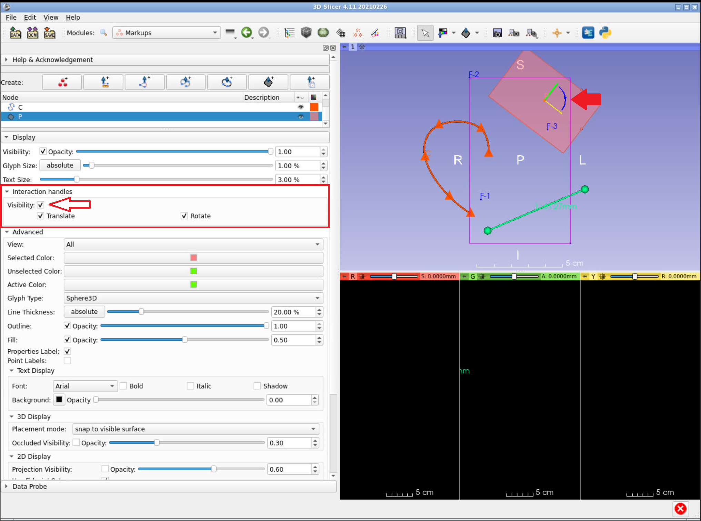
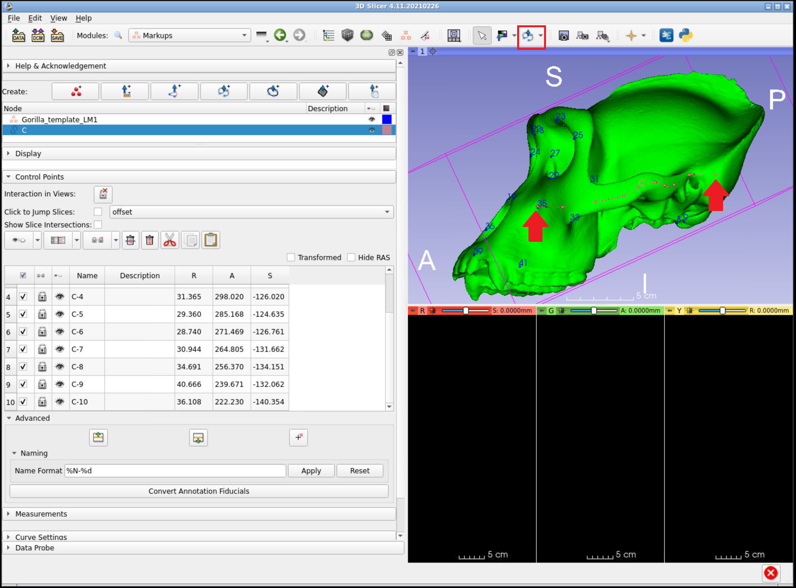
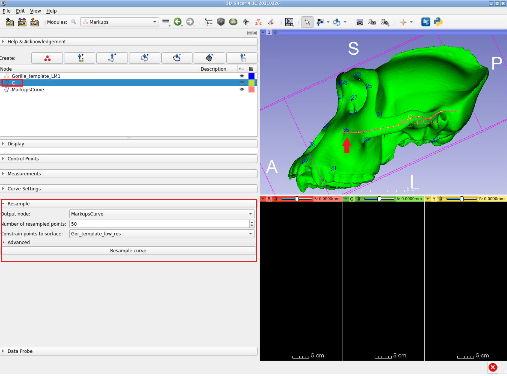
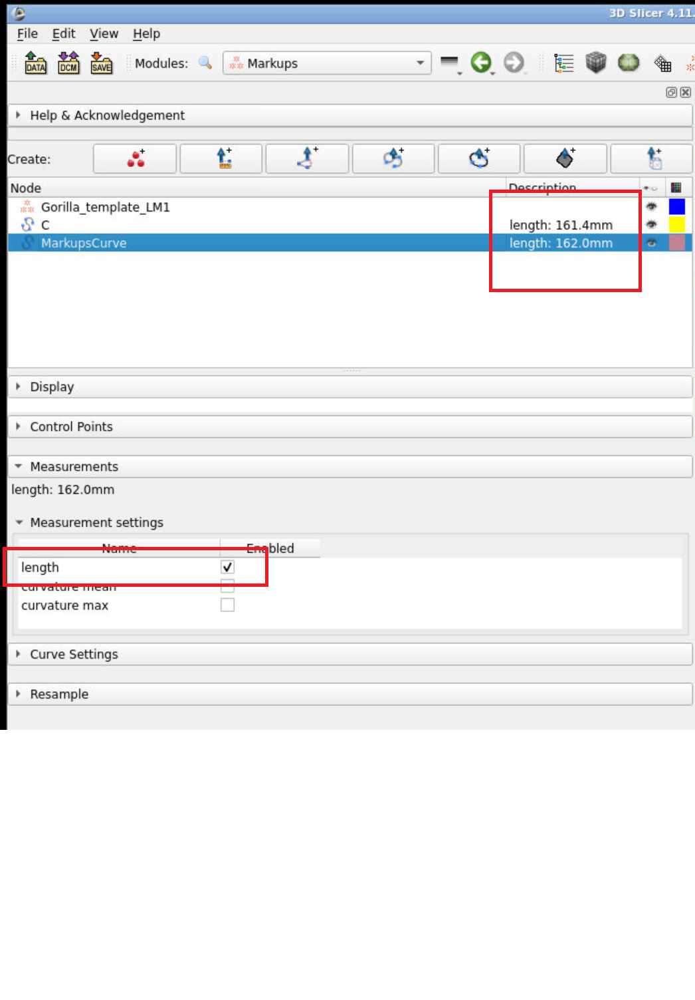

## Measurements and Visualization 
### Overview of markups
* Stable version of Slicer only supports fiducial markups (please do not use stable 4.10 anymore) 
* Slicer Preview (4.11) and SlicerMorph versions add: lines, angles, ROIs, open and closed curves, and planes, as well as improved handling of large numbers of markups (thousands range). 


* Updates to Markups module are ongoing so check back for updates
### Markup Types
**ROI:**
Place two points sequentially that specify corners of a rectangular cube defining the region of interest. The size and shape of the rectangle can be adjusted after placement.

**Fiducials:**
Place a single landmark point.

**Lines:**
Sequentially place two points, creating a line between them.

**Angles:**
Place three points sequentially. This forms two vectors where the second point placed is the vertex. The angle beween the two vectors is displayed.

**Open and closed curves:**
Sequentially place points. A curve will be fit to the points and updated as additional points are added. If the closed curve is selected, the first and last points placed will be connected.

**Planes:**
To be added


### Markup Placement
  * Slicer has two mouse modes: Transform, and Place. 
  * Transform mode is the default interaction mode. This mode allows interaction with loaded data (pan, zoom, rotate)
  * The icons in the mouse mode toolbar at the top of the main GUI allow to switch between these modes
  * Place mode allows to place one object then switches modes back to Transform mode. Fiducial is the default object.
  * If there is no active Markup node, one will be created with the first placement. Curve points and fiducials will be added to the active Markup node, if one exists. 
  * Place mode can be made persistent by clicking the checkbox in the mouse mode toolbar.


### Markup Management
Fiducial points and anchor points of lines, curves, and angles can be accessed and manipulated using the `Markups` module. 

* In the Create menu, a new node Markups node can be created for fiducials, lines, angles, and curves.
* In the Display menu, set the visibility, opacity, glyph and text size of a markup node. Expand the Advanced tab for additional options.
* In the Control Points menu, use the table to adjust visibility, labels, and position of individual fiducials or anchor points


### Example 1: Using Markups for Measurement
In this example, we will place a closed curve on one slice of a CT scan, measure the area of the curve, and visualize the region. For more detail and discussion, see the Slicer discourse thread [here](https://discourse.slicer.org/t/how-can-i-calculate-an-area-on-a-ct-image-i-can-calculate-volumes-mm-3-but-not-areas-mm-2/1549/7).

1. Select the `Sample Data` module and load the MRIHead volume. 
 

2. Select the closed curve markup mode and place a curve around the brain tissue in the red view window (axial slice). You can change the Slicer layout to red window only for better detail.


3. Open the Python Interactor and paste the following snippet of code to calculate the area of the curve:
```
curve=slicer.util.getNodesByClass("vtkMRMLMarkupsClosedCurveNode")[0]
crossSectionSurface = vtk.vtkPolyData()
areaMm2 = slicer.modules.markups.logic().GetClosedCurveSurfaceArea(curve, crossSectionSurface)
print("Curve {0}: surface area = {1:.2f} mm2".format(curve.GetName(), areaMm2))
```


4. If you switched to the red slice view layout in the Slicer application, switch back to the conventional layout. To visualize the area of the curve, type the following code snippet in the Python Interactor:
```
crossSectionSurfaceModel = slicer.modules.models.logic().AddModel(crossSectionSurface)
crossSectionSurfaceModel.SetName("{0} surface".format(curve.GetName()))
crossSectionSurfaceModel.CreateDefaultDisplayNodes()
crossSectionSurfaceModel.GetDisplayNode().BackfaceCullingOff()
crossSectionSurfaceModel.GetDisplayNode().SetColor(curve.GetDisplayNode().GetColor())
crossSectionSurfaceModel.GetDisplayNode().SetOpacity(0.5)
crossSectionSurfaceModel.SetDescription("Area[mm2] = {0:.2f}".format(areaMm2))
```
 
 
### Example 2: Using the `Line Profile` module
In this example, we will use the `Line profile` module to place a line and examine the intensities of a volume along the line.

1. Check that the MRHead volume from example 1 is loaded in the scene.

2. Select the line markup mode and place a line along an area of interest in one of the slice views. This could also be done using an open or closed curve.

3. Select the `Line Profile` module. Choose MRHead as the input volume, the line you created (by default named **L**) as the input line and choose the options to create a new output table and plot series. If needed, you can adjust the number of samples along the line using the Line resolution slider. Select the **Compute intensity profile** button and a line plot of the intensity volume intensity values sampled along the line will be displayed. From the `Data` module you can also view the results as a table by clicking the eyeball next to the name of the table node.


## Visualization: Displaying 3D Model Data
3D Models (also called Mesh) data in Slicer is displayed using the `Models` Module. It can not be rendered using the `Volume Render` module. Fiducial points are automatically placed on the surface of the a loaded mesh and will be constrained to the surface when they are moved. The control points for other markups are also constrained to mesh surfaces when present. 

## Example 3: Displaying a Mesh and resampling a curve on the surface
1. Load the Gorilla Skull Reference Model under the SlicerMorph tab of the `Sample Data` module (you will need SLicerMorph installed to see this option in the menu).


2.Center the dataset in the 3D viewing window using the button at the top left of the window. Optionally, change to the 3D only layout.


3. Open the `Models` module. Experiment with changing the color and opacity of the skull.


4. Select open curve placement mode from the upper menu bar and place a curve between landmarks **35** and **42** using approximately 10 points. Note that the control points are snapped to the mesh, but the curve itself may lie above or below the mesh surface. 


5. Open the `Markups` module. Expand the Resample Menu. Select **Create a new markups curve** from the Output node selector and set the number of resampled points to 50. In the **Constrain points to surface** menu, select the loaded gorilla mesh. Before resampling, confirm that the curve to be resampled is selected as the active node in the `Markups` table. 


Click the **Resample curve** button to generate a new open curve with 50 points constrained to the mesh surface. This results in a curve that is closer to the actual surface curvature than the original. Note any difference in length between the original and resampled curves reported in the `Markups` table.


