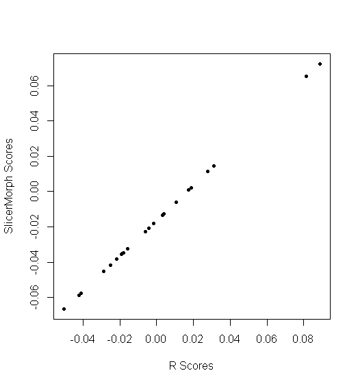

## Getting SlicerMorph Data into R

Currently the simplest way is to read the same fcsv folder you used for `GPA` module into R. 
If you have R and Morpho installed on your computer, you can copy this code, paste into an editor and change the paths to point out to the correct locations in your Cache folder. 

I am using the gorilla skulls example from the GPA module. If you haven't gone through that example in yesterday, you might want to download it from the `SampleData` module and then run it quickly with `GPA` module, and update the file paths. 

```
# change the path below to the location of your cache folder.
path = 'C:/temp/RemoteIO/Gorilla_Skull_LMs/'
setwd(path)
fcsvs=dir(patt='fcsv', path=path)
n=length(fcsvs)
no.LMs=41
LMs=array(dim=c(no.LMs, 3, n))

read.fcsv=function(file=NULL){
  return(as.matrix(read.csv(file=file, skip=2, header=T)[,2:4]))
}

for (i in 1:n) LMs[,,i] = read.fcsv(fcsvs[i])

library(Morpho)

GPA = procSym(LMs)

plot(GPA$PCscores[,1:2], pch=20)

#Remember to change the path to the correct output location of Gorilla SKull datasets.

PCs.from.SlicerMorph = read.csv(file='C:/temp/RemoteIO/Gorilla_Skull_LMs/2020-08-19_20_12_04/pcScores.csv')
head(PCs.from.SlicerMorph[,1:5])

plot(GPA$PCscores[,1], PCs.from.SlicerMorph[,2], pch=20, xlab="R Scores", ylab='SlicerMorph Scores')
cor(GPA$PCscores[,1], PCs.from.SlicerMorph[,2])
```

You should see plot that looks like the pne below, and almost perfect correlation between first PCs scores (within machine precision)



You can try the other PCs and outputs on your own...
