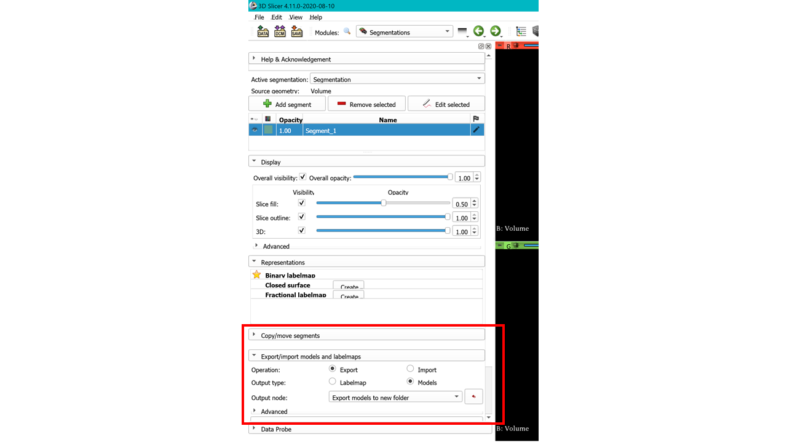
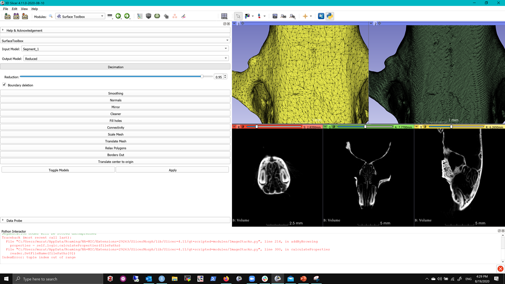
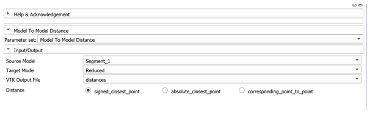
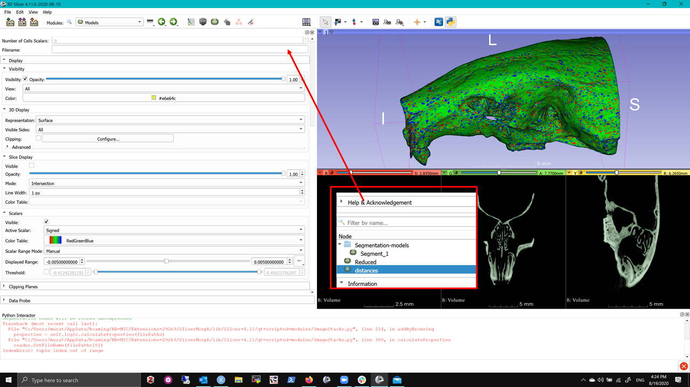
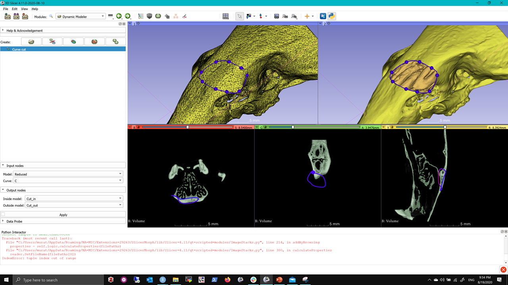

## Editing Meshes in Slicer  

0. If you want to do the step #7, you will need to install **Model to Model Distance Extension** from the Extension Manager, as this is not an extension currently bundled with SLicerMorph. After the install, you need to restart the Slicer for the module to be available. If you don't want to do this step, you can just read the tutorial and come back to it at a more convenient time. 

1. For this exercise, we will use the sample microCT stack from the `Sample Data` module. This is the same dataset we used in Day 1 to test the `ImageStacks`. If you don't have it anymore from Day 1, go to `Sample Data` module, and click on **Sample MicroCT Stack**, and then use the `ImageStacks` to import it. 

2. To create a 3D model from scratch, first we need to segment, and then export this segmentation as a 3D model data node. To do this, switch to the `Segment Editor`, and use the threshold tool to create a segmentation of the full skull. You can experiment with either automated threshold methods (such Otsu, or Isodata), or you can manually specify the range I used, which is 18-229. 

3. Once you completed the segmentation, switch to the `Segmentations` module, and scroll down to find the **Export/Import models and labelmaps** section, and export the segmentation to a new model node:

4. Find the `Surface Toolbox` and set the input the `Segment_1` model (output of Step #3), and create a new output model (e.g., I called it Reduced). Then, click on the **Decimation** option, and increase the slider to 0.95. What this will do is to reduce the number of polygons in the model by 95%. This will take a few minutes. 

5. Go to `Data` module and make sure both models (Segment_1 and the new output) are visible, and have distinct colors. Then switch to the Dual 3D layout, and use the `Models` module's **Visibility** options to assign one of the models to View #1 and the other to View #2, and then sync both views. (HINT: We have done this in Day 1 [here](https://github.com/SlicerMorph/S_2020/blob/master/Day_1/Models/Models.md), if you need to refresh your memory.). Also change  **Representation** option the default **Surface** to **Surface with edges**. 

6. Review the differences between models in terms of polygon density, and the number of polygons etc. The model that is 95% reduced looks still very much like the original segmentation. So did we loose significant amount of data? We can use the  `Model to Model Distance` module we installed in step #0. You need to set three things: 
  - Source model: This would be the Segment_1 (or whatever the original segmentation is called)
  - Target model: This would be reduced model
  - VTK Output: This would be model where the results are going to be saved. 

  
  
Once you set these, hit Apply and wait. It may take couple minutes. The procedure will calculate the signed (meaning positive or negative) distance between closest corresponding points in these to modesl, and will display this as a heat map a new model based on the Source. 

7. After the calculation is completed, go to the `Data` module and turn off the visibility of everything, except for the output model. Go to `Models` module. First make sure that your active model is indeed the **output** one, not one of the others. Then, scroll down to find the section called *Scalars*. Set the **Scalar Range** to manual, and enter the min and max values of -0.005 and 0.005. What this would to is to render any difference within this range as green and everything outside is red or blue (depending on the sign). What we did is that we call that 10 micron range as tolerable error, and ask slicer to color everything that beyond that range. As you can see even with 95% reduction, the physical differences between models are pretty small.

**IMPORTANT** For the `Model to Model Distance` to produce meaningful results, meshes have to occupy the same space. The module itself doesn't to any alignment or superimposition. So if you are tempted to use this model, e.g., to compare two different mouse skulls, you will have to find a way of bringing them into the same space (i.e., co-registering them). In the procedure above, we didn't need to do that, since one mesh is a direct derivative of the other at the identical location.   

Now go back to the `Surface Toolbox` and review other editing functions, such as **Mirror**, **Scale Mesh** and **Smoothing**. With these, you may not need to go to a dedicated mesh editing tool like **MEshLab**. But of course, functions in the `Surface Toolbox` is limited to a few common tasks. 

##Dynamic Modeler

An emerging tool in Slicer is the new `Dynamic Modeler` tool, which aims to provide direct mesh editing in Slicer. Currently, the functionality is limited to cutting meshes with various markups (such as a Plane or a curve). But even with these, it is actually fairly powerful. Continuing from the exercise above, we will demonstrate one use case in which you can make a surface cut with a close curve and calculate its area accurately. 

8. Go to `Data` module, and make sure the only visible model is the reduced module from Step #4. Using the close curve, draw an arbitrary curve as shown below. 

9. Search for the `Dynamic Modeler` and then choose the **Curve Cut** and enter the settings such that the input model is the reduced from Step #4, and the curve is from the previous step. Then create two output nodes called **cut_in** and **cut_out**, and hit **Apply**.

10. Go back to the `Data` module and turn off the visibility of all models, except for initially cut_in, review the output, and then turn it off and review the cut_out. The resultant cut should make a hole in the nasal region. 

11. Now you can use the `Models` module, and see the accurate surface area of **cut_in**

**Note** Dynamic modeler is very recent, if you encounter issues please post it on the Slicer forum along with the error log, so that the developers can fix the issues. 

