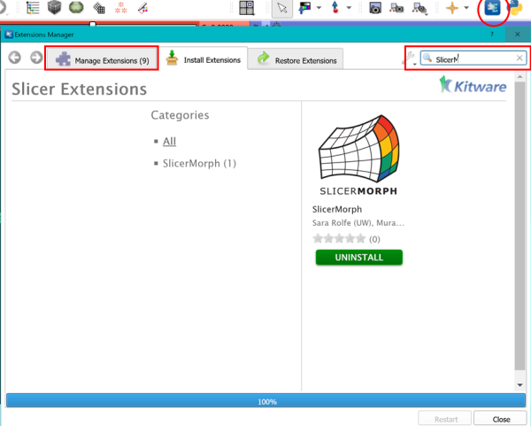
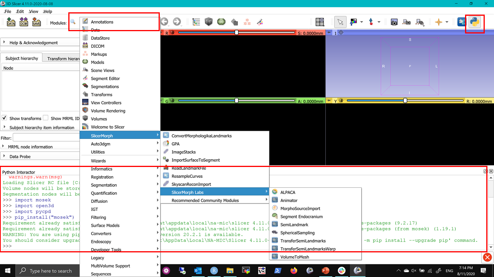

## Tech Check-in Instructions:


1. Download the preview r29263 from https://download.slicer.org/?date=2020-08-11 (please make sure you are using this specific version not an earlier or a later version, this is to make sure everyone is using the same version). 

2. While installing if you receive warning about security or unknown publisher, ignore and processed with installation. If you are a Mac user you might have to do [these steps to run Slicer after installation](https://discourse.slicer.org/t/unsigned-application-issue-on-mac/12930/2?u=muratmaga).

3. Open extension manager, go to “Install Extensions” tab and search for SlicerMorph and click *install*.
Wait until all 9 extensions are shown under “Manage Extensions” tab, and then click Restart
After the restart, open the module list and see that SlicerMorph is now listed.



4. Click on ALPACA (SlicerMorph->SlicerMorph Labs), this will download and install an external python library called *Open3D*. It is a large library and it may take 5-10 minutes to install, during which Slicer will look like it stalled. Be patient. [Mac users who are using versions earlier than 10.15, need to follow this instructions in their Python console.](https://discourse.slicer.org/t/cant-load-open3d/12950/6?u=muratmaga) 

5. Then go to Auto3Dgm, which will also download an external python library called Mosek. 
Mosek is a proprietary library and you will need a license to run. You can either request a free academic license for a year, or ask for a trial license for 30 days. Follow the license installation instructions at https://toothandclaw.github.io/installations. **HINT:** you can actually search for a file called *save_mosek_license_here* and copy the license file (mosek.lic) sent to you to the same place as this file. 

6. If you haven't encountered any issues, at this point you should be set. Please type these comments to your python window to double-check (there should no error messages):

  ```import open3d```
  
  ```import pycpd```
  
  ```import mosek```
  
If you end up getting error message about any of these libraries being missing, then you can try manual installatio (again type these to your python console):

```pip_install("open3d")```
  
  This will manually install the open3d, for other libraries change the open3d to whatever is missing. 




### Other considerations
* We highly advise using an external 3-button mouse with Slicer (not a trackpad). 
* If you are working off a laptop, an external monitor would be very useful too. That way you can keep the zoom session on the external monitor while running your own Slicer on your laptop screen. 
* Please do not install slicer or save any of the sample data during workshop in a cloud syncing drive (e.g., onedrive, dropbox or box) or a network drive. We have been many strange issues, including data corruption and missing files. A workshop folder on your desktop is an ideal place to keep all your sample data.    

